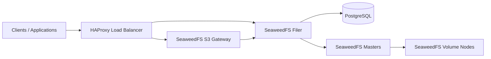

# s3-auto

Terraform-based automation for provisioning an on-prem S3-compatible storage platform on Proxmox.

This repository provisions and configures a small SeaweedFS-based object storage stack with supporting services such as:

- SeaweedFS master nodes
- SeaweedFS filer and S3 gateway nodes
- SeaweedFS volume nodes
- PostgreSQL for filer metadata
- HAProxy as the edge entrypoint
- optional Cloudflare DNS records
- optional Let's Encrypt certificates via DNS challenge

The public version of this repository is sanitized. No real tokens, internal IP addresses, zone IDs, SSH keys or environment-specific state files are included.

## What This Project Demonstrates

- Terraform provisioning on Proxmox
- multi-node service topology for object storage
- post-provision shell automation driven from Terraform
- optional DNS automation with Cloudflare
- optional TLS automation with Certbot
- CI/CD for Terraform formatting and validation

## Architecture

## Repository Layout

- `infra/`: Terraform code for Proxmox VMs, DNS and post-provision hooks
- `infra/script/`: shell scripts used during post-clone automation and validation
- `.github/workflows/terraform.yml`: GitHub Actions workflow for Terraform quality checks

## Main Components

### Terraform

The Terraform layer handles:

- VM provisioning on Proxmox
- cloud-init settings
- DNS records in Cloudflare
- post-clone execution of installation scripts

### Post-clone automation

The shell layer handles:

- SeaweedFS installation
- PostgreSQL setup for filer metadata
- HAProxy setup for UI and S3 traffic
- optional Certbot automation for HTTPS

## Typical Workflow

1. Fill in `infra/terraform.tfvars` from the example file.
2. Run `terraform init`.
3. Run `terraform plan`.
4. Run `terraform apply`.
5. Validate the platform with `infra/script/verify.sh`.

## Files You Should Customize

- `infra/terraform.tfvars`
- `infra/script/config.sh` if you want a static fallback inventory
- domain names and DNS settings
- VM sizing, VM IDs and target node placement

## Proxmox API Endpoint

For GitHub Actions with a public Proxmox endpoint, prefer:

- `pm_api_url = "https://proxmox.cosmin-lab.cloud/api2/json"`
- `pm_tls_insecure = false`

Use `:8006` only when you are targeting the management port directly, for example from an internal runner:

- `pm_api_url = "https://proxmox.example.internal:8006/api2/json"`
- `pm_tls_insecure = true` only if that endpoint uses a cert you do not trust

## Sensitive Data Policy

Do not commit:

- `terraform.tfvars`
- `*.tfstate`
- `.terraform/`
- generated HAProxy configs
- API tokens
- private keys
- environment-specific snippets

The repository already ignores the common sensitive files.

## CI/CD

GitHub Actions validates Terraform on every push and pull request:

- `terraform fmt -check`
- `terraform init -backend=false`
- `terraform validate`

For actual provisioning, use the manual CD workflow in `.github/workflows/deploy.yml`.

### Recommended CI/CD split

- `terraform.yml`: safe CI on GitHub-hosted runners for formatting and validation
- `deploy.yml`: manual CD on GitHub-hosted runners for `plan`, `apply`, `verify`, `destroy`

### GitHub-hosted runner requirements

- public network access from GitHub Actions to the exact `pm_api_url` used by Terraform
- public network access from GitHub Actions to the VM subnet if you want `infra/script/verify.sh` and post-clone SSH automation to work
- if you use the public hostname, set `pm_api_url` to `/api2/json` on `443`, not `:8006`
- installed commands are handled in the workflow: `jq`, `sshpass`

### Required GitHub secret

- `TFVARS_HCL`: full contents of your real `infra/terraform.tfvars`

This is the simplest reliable setup for this repo because the tfvars include nested VM objects, credentials, DNS settings and post-clone parameters.

If your Proxmox API is only reachable on a private IP, or your chosen `pm_api_url` is not reachable from GitHub Actions, GitHub-hosted `apply` will fail. In that case you need either:

- a self-hosted runner inside your network
- a VPN/tunnel step inside the workflow before `terraform init/plan/apply`

### Manual workflow actions

- `plan`: runs `terraform plan` and uploads the saved plan
- `apply`: runs `plan`, then `terraform apply`, then `infra/script/verify.sh`
- `verify`: runs only `infra/script/verify.sh`
- `destroy`: runs `plan`, requires `confirm_destroy=destroy`, then destroys resources

## Portfolio Angle

This project is not just “Terraform for a VM”.

It shows:

- infrastructure provisioning
- stateful distributed service layout
- DNS and TLS integration
- post-provision automation
- practical on-prem object storage design
