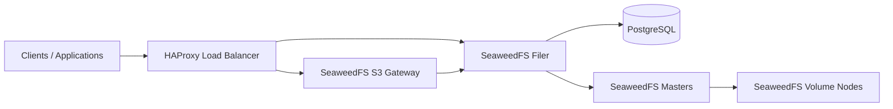

# s3-auto

Terraform-based automation for provisioning an on-prem S3-compatible storage platform on Proxmox.

This repository provisions and configures a small SeaweedFS-based object storage stack with supporting services such as:

- SeaweedFS master nodes
- SeaweedFS filer and S3 gateway nodes
- SeaweedFS volume nodes
- PostgreSQL for filer metadata
- HAProxy as the edge entrypoint
- optional Cloudflare DNS records
- optional Let's Encrypt certificates via DNS challenge

The public version of this repository is sanitized. No real tokens, internal IP addresses, zone IDs, SSH keys or environment-specific state files are included.

## What This Project Demonstrates

- Terraform provisioning on Proxmox
- multi-node service topology for object storage
- post-provision shell automation driven from Terraform
- optional DNS automation with Cloudflare
- optional TLS automation with Certbot
- CI/CD for Terraform formatting and validation

## Architecture

## Repository Layout

- `infra/`: Terraform code for Proxmox VMs, DNS and post-provision hooks
- `infra/script/`: shell scripts used during post-clone automation and validation
- `.github/workflows/terraform.yml`: GitHub Actions workflow for Terraform quality checks

## Main Components

### Terraform

The Terraform layer handles:

- VM provisioning on Proxmox
- cloud-init settings
- DNS records in Cloudflare
- post-clone execution of installation scripts

### Post-clone automation

The shell layer handles:

- SeaweedFS installation
- PostgreSQL setup for filer metadata
- HAProxy setup for UI and S3 traffic
- optional Certbot automation for HTTPS

## Typical Workflow

1. Fill in `infra/terraform.tfvars` from the example file.
2. Run `terraform init`.
3. Run `terraform plan`.
4. Run `terraform apply`.
5. Validate the platform with `infra/script/verify.sh`.

## Files You Should Customize

- `infra/terraform.tfvars`
- `infra/script/config.sh` if you want a static fallback inventory
- domain names and DNS settings
- VM sizing, VM IDs and target node placement

## Sensitive Data Policy

Do not commit:

- `terraform.tfvars`
- `*.tfstate`
- `.terraform/`
- generated HAProxy configs
- API tokens
- private keys
- environment-specific snippets

The repository already ignores the common sensitive files.

## CI/CD

GitHub Actions validates Terraform on every push and pull request:

- `terraform fmt -check`
- `terraform init -backend=false`
- `terraform validate`

You can extend it with manual `plan` or `apply` jobs using repository secrets.

## Portfolio Angle

This project is not just “Terraform for a VM”.

It shows:

- infrastructure provisioning
- stateful distributed service layout
- DNS and TLS integration
- post-provision automation
- practical on-prem object storage design

